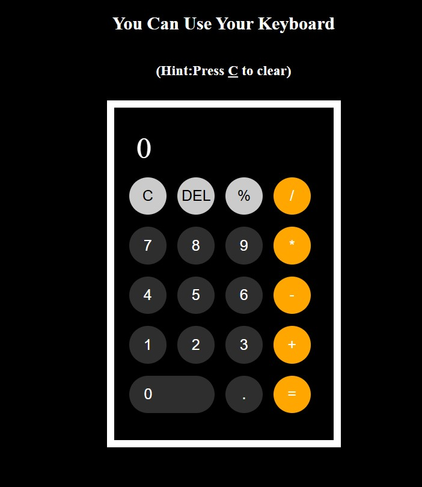

# Calculator
Simple Calculator built using HTML, CSS, JS. It can be used for adding, subtracting, multiplying, dividing, getting remainder.

## Features
- Keyboard can be used.
- press C to clear.
- Press backspace to delete.
